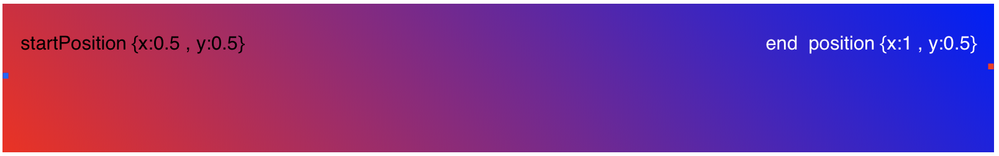

# Image gradient, react component 
React native package to display a gradient filter over an image.

## To install 
* Run `npm install react-native-image-gradient -s`.
* Run `react-native link` (**or** follow instructions to *add react-native-linear-gradient to your project* [here](https://www.npmjs.com/package/react-native-linear-gradient)).

## Usage 
```javascript 
import ImageGradient from 'react-native-image-gradient';

...

render(){
    return (
        <ImageGradient 
            mainStyle={styles.YOURS}
            gradientStyle={styles.YOURS}
            localImage={true|false}
            imageUrl={localReference|webReference}
            startPosition ={{x:0,y:0}}
            rgbcsvStart={'255,255,255'}
            rgbcsvEnd={'0,0,0'}
            opacityStart={0.9}
            opacityEnd={0.0}
        >
            <...>

        </ImageGradient>
    )
}
```

## Props 

* **mainStyle** - styling for the main view component.
* **gradientStyle** - styling for the iner view containing gradient view.
* **imageUrl** - local or web path to the image. (if using web path, please set the localImage prop to false).
* **localImage** - flag to specify wether the path is local or not. Default: true.
* **startPosition** - initial coordinates for the gradient effect.Range [0-1].  
* **endPosition** - final coordinates for the gradient effect.Range [0-1]. 
> **PS:** X is from left to right and Y is from top to bottom. Check the image [below](#image).
* **rgbcsvStart** - color (in csv format) for the beginning of the linear gradient. Default: black `'255,255,255'`.
* **rgbcsvEnd** - color (in csv format) for the end of the linear gradient. Default: white `'0,0,0'`.
* **opacityStart** - opacity for the primary color. Range [0-1].
* **opacityEnd** - opacity for the secondary color. Range [0-1].

> **PS:** All props are optional
<div id="image">



</div>